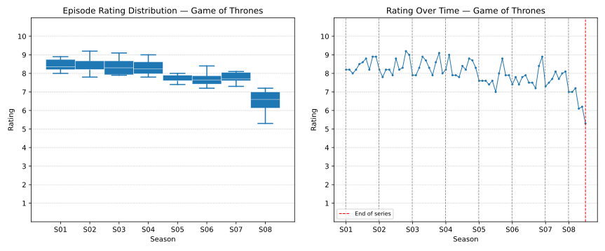
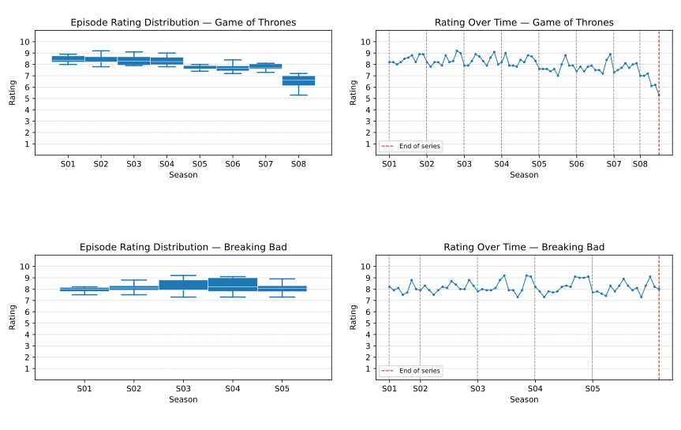

# TV Show analysis script

This repository contains a python script which can visualise TV show episode ratings in numerous different ways.
It grabs data from [TVmaze](https://www.tvmaze.com/) (Chosen because of the lack of need for using an API key), and visualizes the episode ratings in graphs.

## Usage

First, install all of the nescessary packages, which include `python3` and `matplotlib`:

In my case on Fedora:

```bash
sudo dnf install python3 python3-matplotlib
```

After, clone the repo and change into the directory:

```bash
git clone git@github.com:simonzweers/series-analysis.git
cd series-analysis
```

Run the script; example usage:

```bash
python3 series-analysis.py "The Bear"
python3 series-analysis.py "The Bear" "The Blacklist" "Friends"
```

Example of usage on Game of Thrones:



Example of usage on Game of Thrones and Breaking Bad:


